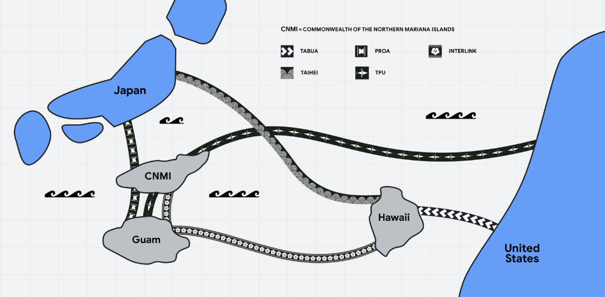

# Google、日本とハワイを直結する海底ケーブル他の構築に1500億円投資
米Googleは4月11日（現地時間）、日本に届く新たな2本の海底ケーブル「Proa」と「Taihei」の構築に、10億ドル（1500億円）を投資すると発表した。日本のNEC、KDDI、アルテリア・ネットワークスなどと協力する。

上の画像の複数のケーブルは、Googleが2022年に岸田総理大臣に提言した「日本デジタル未来構想」の一環で、米国と日本の間に新たな光ファイバーケーブルを配設することで、領土間のデジタル接続の信頼性と可用性を高めるとしている。

NECの協力で構築するTaiheiは、日本語の「平和」と「太平洋」の「太平」から名付けられた、日本とハワイを結ぶ海底ケーブル。フィジーと米国本土を結ぶ「Tabua」（フィジーの神聖なクジラの歯にちなんだ名前）がハワイまで延伸されることで、米国大陸と日本は海底ケーブルで結ばれることになる。